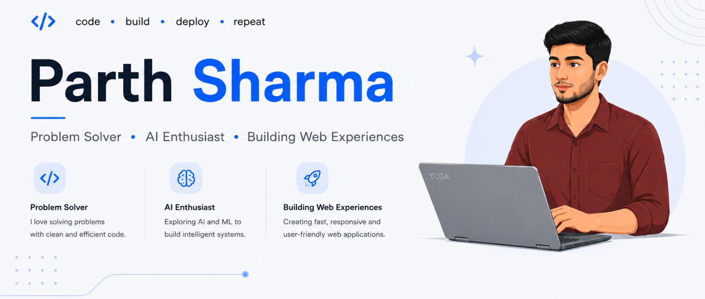

  

---
Computer Science undergraduate passionate about building scalable web applications and modern digital experiences. Skilled in Full-Stack Development using MERN Stack, REST APIs, and modern frontend technologies.

---

# 🛠 Tech Stack

## Languages

---

## Frontend

---

## Backend & Database

---

## Tools

---

# 🌐 Connect With Me

---

<h3 align="center">
⚡ Focused on writing clean, maintainable, and production-ready code.
</h3>
