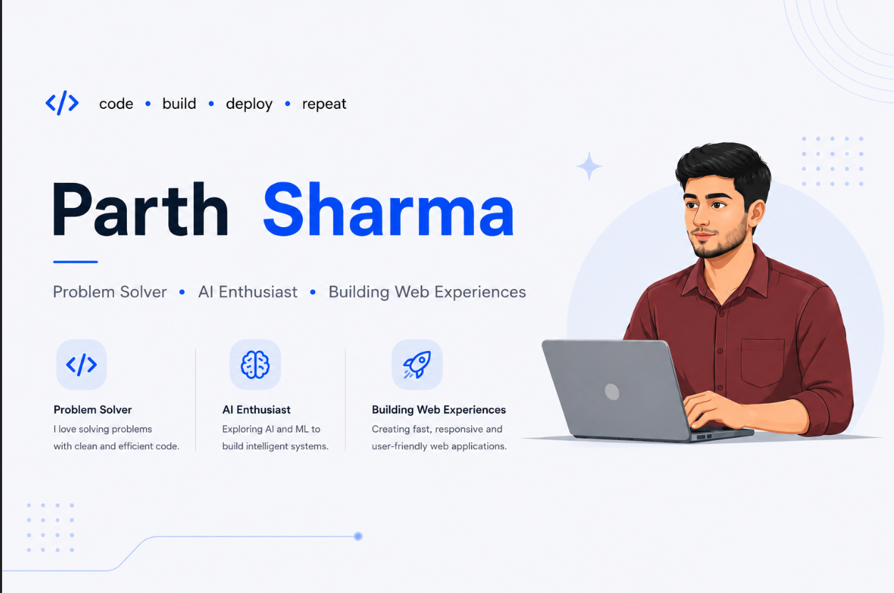

  

---

Computer Science undergraduate passionate about building scalable web applications and modern digital experiences.
Skilled in MERN Stack, REST APIs, and modern frontend technologies.

---

# 🛠 Tech Stack & Tools

## 💻 Languages

---

## 🚀 Frameworks & Libraries

---

## 🗄 Databases & Tools

---

# 🌐 Connect With Me

---

# ⚡ Fun Quote

---
